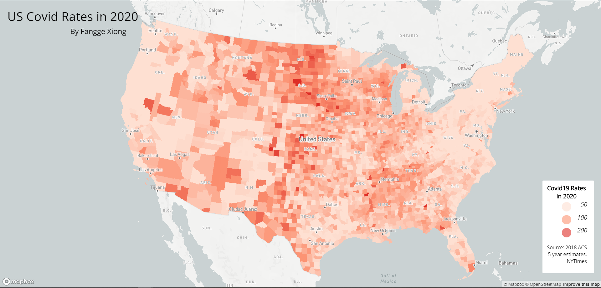
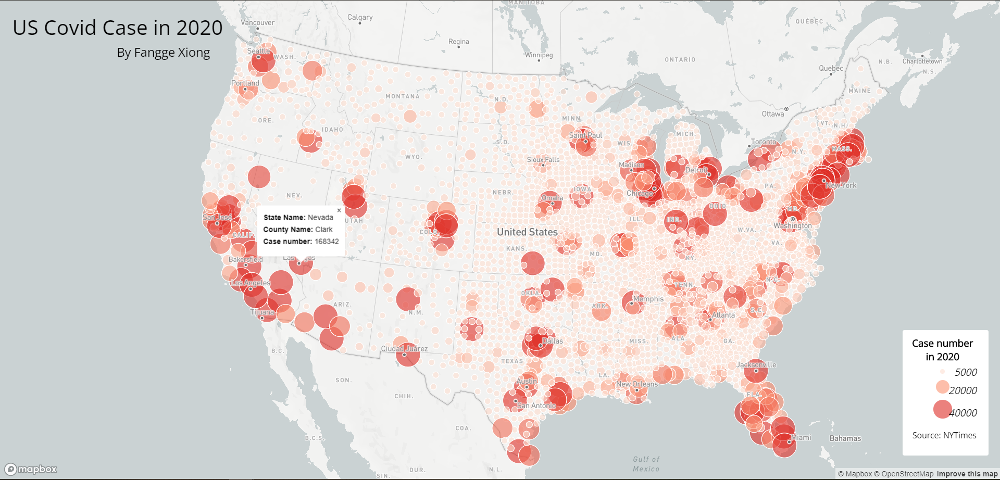

# Lab 3: Web Map Application

**By:** Fangge Xiong

In this lab, I created two interactive web maps recording US covid-19 cases and rates in 2020. **Map 1** is a choropleth map of the covid-19 rates and **Map 2** is a proportional symbols map of covid-19 cases. 

### Map 1: US Covid-19 Rates in 2020

This map shows the rate per thousand residents in the US who get Covid in 2020. You can view the specific rate and location (state and county) by clicking on the area of your choice. There are three level of rates. The lightest shade means the rate is less than 50 in that area, while the darkest shade means the rate is more than 200. 

From the map, you can tell that the east and west coast have less rate compare to the middle of the US. States like Colorado and South Dakota have the most serious problem. 

### Map 2: US Covid-19 Counts in 2020

This map shows the total number of covid-19 cases in each county of the US in 2020. You can view the specific case number and location (state and county) by clicking on the area of your choice. 

From the map, you can find that each corner of the US, such as New York, Miami, Los Angeles, and San Jose, get the most number of cases. It might seem different than map 1. A large reason could be that east and west coast have a way larger population compared to the central US. 

### Acknowledgment
- Map Projection: Albers
- Library: Mapbox GL JS
- Data Source: 
    - COVID-19 case/death data is from [The New York Times](https://github.com/nytimes/covid-19-data/blob/43d32dde2f87bd4dafbb7d23f5d9e878124018b8/live/us-counties.csv)
    - The population data used for calculating the case rates are from the [2018 ACS 5 year estimates](https://data.census.gov/cedsci/table?g=0100000US.050000&d=ACS%205-Year%20Estimates%20Data%20Profiles&tid=ACSDP5Y2018.DP05&hidePreview=true)
    - The U.S. county boundary shapefile was downloaded from [the U.S. Census Bureau](https://www.census.gov/geographies/mapping-files/time-series/geo/carto-boundary-file.html)
